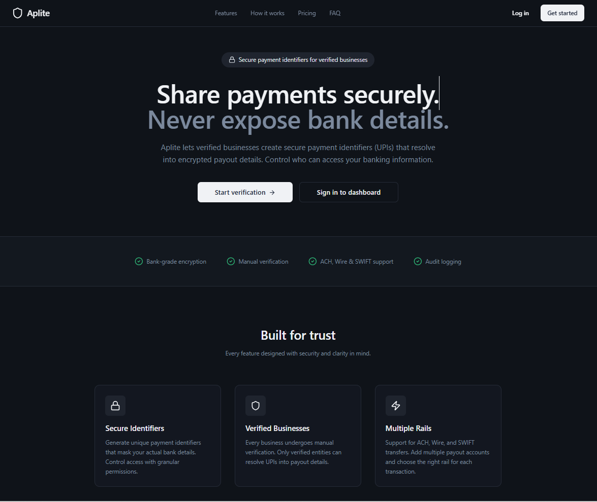
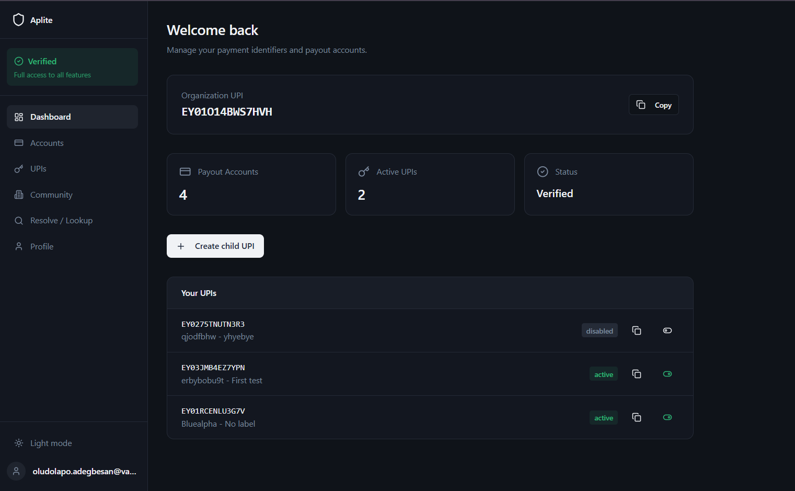
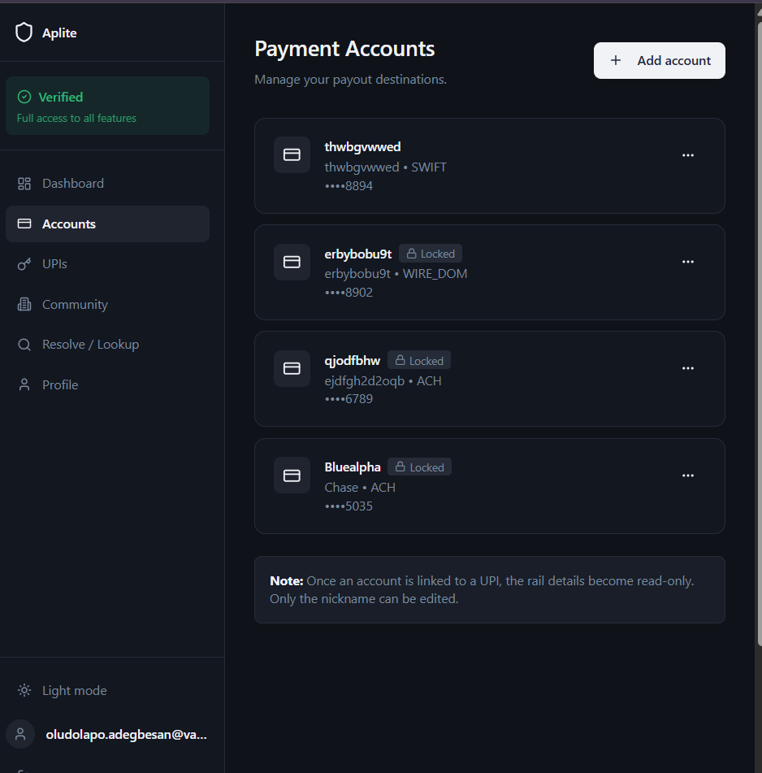
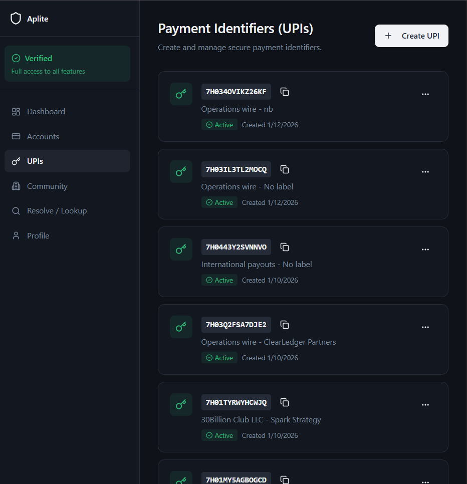
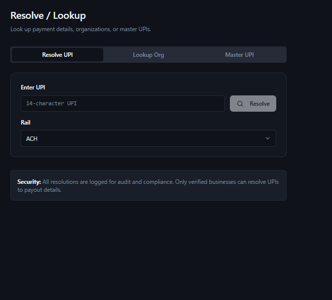

# APLITE

**Payment identity infrastructure for verified businesses.**

> Aplite replaces bank-detail sharing with verified payment identifiers.

---

## Why I Built This

Every day, businesses send payment details - account numbers, routing numbers, SWIFT codes - through the least secure channels imaginable: email threads, WhatsApp messages, PDF attachments, shared spreadsheets. And then they do it again. And again. With every new vendor, partner, or platform they work with.

This is how B2B payments work today. It is manual, fragile, and deeply insecure.

The consequences are real:
- **Fraud.** Business email compromise (BEC) attacks that swap payment details mid-thread cost businesses billions annually.
- **Operational drag.** AP teams spend hours re-collecting, re-verifying, and re-entering payment details for every new relationship.
- **Compliance exposure.** Unverified vendors, unencrypted data, no audit trail - a nightmare for any regulated business.

What bothered me most was how accepted this was. Everyone knows it's broken. Nobody had built the layer to fix it.

That layer is what APLITE is.

---

## The Vision

A world where business payment identity works like email: one address, globally resolvable, trusted by the receiver, controlled by the sender.

You don't re-share your email address every time you want to receive a message. You shouldn't have to re-share your bank details every time you want to receive a payment.

APLITE is building the identity layer that makes that possible - starting with the businesses that feel this pain most acutely: AP teams, marketplaces, freelancer platforms, vendor networks, and any business managing payouts at scale.

The long-term goal is a world where businesses have a stable, verified payment identity that survives changes to bank accounts, payout rails, team members, or counterparties. Where money moves with confidence, not guesswork.

---

## How APLITE Works

APLITE replaces raw bank-detail sharing with a short, safe, portable identifier called a **UPI - Unique Payment Identifier**.

A UPI is safe to share publicly. The sensitive payout coordinates behind it are encrypted, verified, and only exposed through controlled resolution.

**Plain-language flow:**

1. A business signs up and completes KYB (Know Your Business) verification.
2. The business registers its payment rails - ACH, domestic wire, SWIFT.
3. APLITE stores the sensitive payout details securely (AES-256 encrypted).
4. The business receives a verified UPI - its payment identity.
5. The business shares its UPI instead of raw bank details.
6. Authorized partners resolve the UPI when they need payout coordinates.
7. Every resolution is logged. Every change is controlled.

Three things make the system work:

### Verified Payment Identity
No business gets a UPI without going through verification. We collect legal entity details, formation documents, and verify the identity of the owner or authorized representative - either via live video call or government ID upload. The verification queue is reviewed by a human before a UPI is issued.

### Encrypted Payment Accounts
Bank details are encrypted at rest before they ever touch the database. When a partner resolves a UPI, they get only the coordinates they are permitted to receive - for the rail type they requested. No exports, no spreadsheets, no copying.

### Child UPIs
Once verified, businesses can issue child UPIs - scoped identifiers linked to specific payment accounts. Each child UPI is independently controllable: active, disabled, or revoked at any time. A marketplace might issue one per payout rail. A vendor might issue separate UPIs for different receiving entities.

---

## Who This Is For

APLITE is built for organizations where payout accuracy, vendor trust, and operational control are not optional.

**Primary customers:**
- Accounts payable teams managing high vendor volumes
- Marketplaces that make payouts to sellers, contractors, or creators
- Freelancer and contractor platforms
- Vendor and supplier management teams
- B2B software platforms with embedded payout flows
- Regulated businesses with compliance requirements around payment data

These teams all share one recurring, expensive question:

> *Are we paying the right verified business, using current, accurate payment details?*

APLITE answers that question before money moves.

---

## Product Principles

- Payment identity should be easy to share but hard to abuse.
- Sensitive bank details should not move through casual workflows.
- Verification should happen before money moves, not after a mistake.
- Businesses need auditability when payout information is accessed or changed.
- A stable payment identity should survive changes to bank accounts or rails.

---

## What Is Built Today

### Public Surface
- Landing page with product overview and CTAs
- Pricing page with tier breakdown
- FAQ page
- Full legal and trust surface: Compliance, KYB Policy, Privacy Policy, Terms of Service, SLA, Security, Trust pages
- Public client directory - verified businesses visible in the APLITE network

### Authentication
- Email + password signup with email confirmation
- Supabase-backed authentication with JWT session management
- Secure auth callback handling

### KYB Onboarding Flow (6 steps)

| Step | What Happens |
|------|-------------|
| 1 | Legal name, DBA, EIN, formation date, entity type, address, industry, website, description, formation document upload |
| 2 | Owner or authorized representative selection, executive title |
| 3 | Verification method selection - schedule live call (owners) or upload government ID (reps) |
| 4 | Payment account setup - add ACH, domestic wire, or SWIFT rails |
| 5 | Full review and attestation |
| 6 | Cal.com-integrated call scheduling for owners |

Draft state is saved server-side at each step. Submissions enter a manual review queue. The flow handles both owner paths (video call) and representative paths (ID upload).

### Dashboard
- Onboarding status and verification state at a glance
- Payment accounts and child UPIs summary
- Quick actions: create account, create UPI
- Verification status indicator (Verified / Pending Call / Pending Review / Rejected)

### Payment Accounts
- Create and manage payment rails (ACH, WIRE_DOM, SWIFT)
- Edit account details
- Accounts are locked once linked to a live UPI - no silent changes to active payout destinations

### Child UPIs
- Issue child UPIs linked to specific payment accounts
- Filter by rail type
- Copy UPIs for safe sharing with partners
- Disable and reactivate individual UPIs independently
- Paginated list view

### UPI Resolution (3 modes)
- **Resolve** - retrieve encrypted payout coordinates for a UPI + rail type (for authorized partners)
- **Lookup** - get the public verified profile for a UPI
- **Master Lookup** - find organizations by master UPI, surface owner org information

### Admin Verification Queue
Internal dashboard for reviewing KYB submissions:
- Lists pending sessions by type (call verification, ID verification)
- View uploaded documents inline (ID, formation docs)
- Organization and user information display
- Approve or reject with optional reason
- Risk level indicator per session
- Protected by admin API key, separate from user JWTs

### Profile & Organization Management
- Update user profile and company information
- Manage organization metadata (legal name, address, industry, country)
- View and manage organization verification status
- Reset and resubmit onboarding if rejected
- Reschedule verification calls via Cal.com integration

---

## Screenshots

**Homepage**


**Dashboard**


**Payment Accounts**


**UPIs**


**Resolution**


---

## What Remains - Roadmap

The core identity, verification, and resolution infrastructure is operational. Here is what comes next.

### Core Product
- [ ] **Partner API** - authenticated REST API for programmatic UPI resolution, for AP systems and payout platforms to integrate directly
- [ ] **Webhook delivery** - notify partners in real time when a UPI changes, is disabled, or is revoked
- [ ] **Bulk UPI import/export** - for businesses managing large vendor lists
- [ ] **UPI transfer and reassignment** - safely move a UPI to a new payment account without breaking existing resolutions
- [ ] **Resolution audit log** - full history of who resolved which UPI, when, and which rail they requested
- [ ] **Expiry and rotation** - time-bounded UPIs with automated renewal flows

### Verification and Compliance
- [ ] **Automated KYB checks** - integrate a third-party provider (Middesk, Persona) for partial automation of business verification
- [ ] **Re-verification triggers** - prompt re-verification when business details change materially
- [ ] **OFAC / sanctions screening** - screen entities against watchlists at onboarding and on an ongoing basis
- [ ] **Verification expiry** - periodic re-verification for high-risk or time-sensitive compliance contexts

### Platform and Billing
- [ ] **Stripe billing integration** - subscription management tied to pricing tiers
- [ ] **Usage metering** - resolution API call tracking per organization
- [ ] **Team and member management** - invite team members to an organization with role-based permissions
- [ ] **Organization switching** - support users who belong to multiple organizations

### Developer Experience
- [ ] **API key management UI** - issue and revoke API keys for partner integrations
- [ ] **Public API documentation** - developer docs site for partner integration
- [ ] **Sandbox environment** - isolated test environment with synthetic UPIs for integration testing

### Operational
- [ ] **Internal monitoring dashboard** - resolution volume, error rates, onboarding funnel
- [ ] **Email notification system** - onboarding status updates, verification outcomes, UPI activity alerts
- [ ] **SOC 2 readiness** - evidence collection and controls documentation for enterprise sales

---

## Tech Stack

| Layer | Technology |
|-------|-----------|
| Frontend | Next.js 15, React 18, TypeScript |
| Styling | Tailwind CSS, Radix UI component suite |
| Forms | React Hook Form + Zod validation |
| Data fetching | TanStack Query |
| Backend | FastAPI (Python 3.11) |
| Database | PostgreSQL (Supabase managed) |
| Authentication | Supabase Auth (JWT) |
| Encryption | AES-256 GCM - field-level encryption on sensitive data |
| Storage | Supabase Storage (S3-compatible) |
| Email | SendGrid |
| Scheduling | Cal.com embed |
| Error tracking | Sentry (frontend + backend) |
| Frontend hosting | Vercel |
| Backend hosting | Render |

---

## Architecture

```
┌──────────────────────────────────────────────────────────────────┐
│                       Browser / Partner API Client               │
└────────────────────────────┬─────────────────────────────────────┘
                             │
               ┌─────────────▼──────────────┐
               │     Next.js Frontend        │
               │     (Vercel)                │
               │   Pages, Components,        │
               │   Supabase Auth,            │
               │   React Query               │
               └─────────────┬──────────────┘
                             │  JWT-authenticated requests
               ┌─────────────▼──────────────┐
               │     FastAPI Backend          │
               │     (Render)                │
               │   JWT verification          │
               │   Rate limiting             │
               │   AES-256 encryption        │
               │   HMAC UPI generation       │
               └──────┬───────────┬──────────┘
                      │           │
          ┌───────────▼───┐  ┌────▼────────────────┐
          │  PostgreSQL    │  │  Supabase Storage    │
          │  (Supabase)    │  │  (Documents, IDs)   │
          │  Orgs, UPIs,   │  └─────────────────────┘
          │  Accounts,     │
          │  Sessions      │
          └───────────────┘
```

**Security architecture highlights:**
- Bank details are encrypted with AES-256 GCM before any database write. The plaintext never touches the database.
- UPI signatures are generated via HMAC with a per-deployment secret. UPIs are not guessable or enumerable.
- Onboarding session tokens are stored as HMAC hashes - the server never holds plaintext session state.
- Rate limiting is enforced at the API layer on resolution and lookup endpoints to prevent enumeration attacks.
- Admin endpoints are protected by a separate API key, completely independent of user JWTs.
- CORS, request timeouts, and connection pooling are all enforced at the middleware layer.

---

## Project Structure

```
APLITE-1/
├── aplite-backend/
│   └── app/
│       ├── main.py              # FastAPI app + middleware setup
│       ├── routes/              # auth, accounts, onboarding, resolve, admin, public
│       ├── models/              # Pydantic request/response models
│       ├── utils/               # crypto, email, rate limiting, UPI generation
│       └── db/                  # connection pool + SQL queries
├── aplite-frontend/
│   └── src/
│       ├── pages/               # Next.js pages (landing, dashboard, onboarding, admin)
│       ├── components/          # UI components + onboarding wizard + layout
│       └── utils/               # API client, auth context, app state
├── docs/                        # Architecture, API, onboarding flow, product specs
├── schema-final.sql             # Canonical database schema (use this one)
└── render.yaml                  # Render backend deployment config
```

---

## Local Development

### Prerequisites
- Node.js 18+
- Python 3.11+
- PostgreSQL (or a Supabase project)

### Frontend

```bash
cd aplite-frontend
npm install
cp .env.example .env.local
# Set: NEXT_PUBLIC_API_URL, NEXT_PUBLIC_SUPABASE_URL, NEXT_PUBLIC_SUPABASE_PUBLISHABLE_KEY
npm run dev
```

### Backend

```bash
cd aplite-backend
python -m venv venv
source venv/bin/activate        # Windows: venv\Scripts\activate
pip install -r requirements-backend.txt
cp .env.example .env
# Set: DATABASE_URL, ENCRYPTION_KEY, UPI_SECRET_KEY, SENDGRID_API_KEY, SUPABASE_* vars
uvicorn app.main:app --reload
```

### Database

```bash
psql $DATABASE_URL -f schema-final.sql
```

---

## Further Reading

- `docs/ARCHITECTURE.md` - system design and data flow
- `docs/API.md` - full API reference
- `docs/ONBOARDING_FLOW.md` - KYB flow detail
- `docs/PRODUCT_UI_SPEC.md` - UI and product specification
- `aplite-backend/README.md` - backend-specific setup and notes
- `aplite-frontend/README.md` - frontend-specific setup and notes

---

## Status

APLITE is in active development. The core KYB flow, payment account management, UPI issuance, and resolution infrastructure are operational. Early design partners are being onboarded and the product is being refined based on direct feedback.

If you are building a payout product, running a marketplace, or managing vendor payments at scale - this was built for you.

---

Built by Oludolapo Adegbesan.
